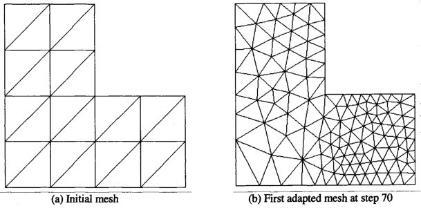
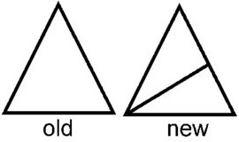
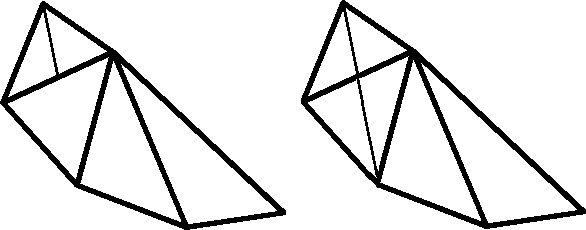
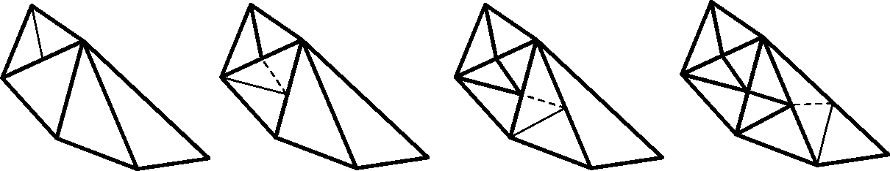

# Progetto Raffinamento

Data una mesh triangolare, raffinare un opportuno sottoinsieme di triangoli in modo da ottenere una mesh più fine.

## Algoritmo

Esistono diversi metodi oer raffinare un triangolo $T$. Si richiede di implementare il metodo denominato "bisezione del lato più lungo".

Per la sua implementazione occorre:
* rintracciare il lato $e^T$ più lungo del triangolo $T$;
* calcolare il punto medio $M_{e^T}$ del lato $e^T$ e unirlo al vertice $V^T_{e^T}$ opposto al lato $e^T$.

In questo modo si generano due sotto-triangoli $T_1, T_2$. 

Si deve dunque procedere a rendere la triangolazione ammissibile, ovvero due triangoli adiacenti devono avere in comune o un intero lato o un solo vertice.
Per farlo, è necessario cercare il triangolo $S$ adiacente al lato $e^T$ e raffinarlo con uno dei due seguenti metodi:

* SEMPLICE - unire il nuovo punto creato $M_{e^T}$ al vertice $V^S_{e^T}$ del triangolo $S$ opposto al lato ${e^T}$;

* COMPLESSO - applicare il metodo di "bisezione del lato più lungo" al triangolo $S$ adiacente e procedere successivamente ad unire il nuovo punto creato $M_{e^S}$ con $M_{e^T}$ creando due nuovi sottotriangoli. Ripetere tale procedura finchè la mesh non risulterà ammissibile.

**NOTA**: il metodo complesso garantisce il mantenimento della qualità della mesh di partenza, durante il processo di raffinamento.

Per identificare i triangoli da raffinare, ordinare i triangoli per valori di area decrescente e selezionare i primi $\theta$ triangoli più grandi.

## Suggerimenti

* Durante la creazione della mesh triangolare servirà tenere conto della adiacenza dei triangoli per ricercare rapidamente il triangolo adiacente ad un lato;
* L'ordinamento dei triangoli per area dovrà essere fatto scegliendo un algoritmo ottimale di ordinamento visto durante l'anno.